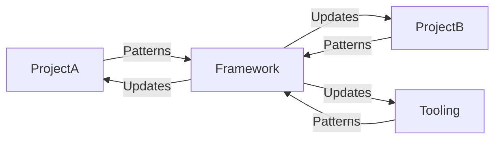

# Module 10 — Framework Evolution & Meta-Governance
**AOSD Curriculum**
**How AOSD Itself Evolves**

---

## 1. Purpose of This Module

This module teaches you how to **critique, evolve, and govern the AOSD framework itself**.

You will learn:

- How AOSD evolves over time
- When to challenge invariants
- How to propose framework improvements
- How to balance stability vs innovation
- How to contribute to living documentation
- Framework versioning and stability principles
- Cross-project learning patterns
- Industry evolution integration
- Meta-governance principles

This is the **most meta module** in the curriculum—it's about improving the methodology you're learning.

---

# 2. Framework Evolution Philosophy

AOSD is a **living framework**, not a static methodology.

### 2.1 Core Principles
1. **Stability First**: Changes must not break existing projects
2. **Evidence-Based**: Evolution driven by real-world experience, not theory
3. **Explicit Over Implicit**: All changes documented and justified
4. **Backward Compatible**: When possible, old patterns continue working
5. **Community Driven**: Learning from all AOSD projects

### 2.2 Evolution Tempo
- **Fast**: Bug fixes, clarifications, examples (days)
- **Medium**: New patterns, tool integrations (weeks)
- **Slow**: Invariant changes, architectural shifts (months)

### 2.3 Why Evolution Matters
**Without evolution**:
- Framework becomes constraint
- Workarounds proliferate
- Best practices ignored
- Disillusionment with methodology

**With disciplined evolution**:
- Framework improves continuously
- Lessons learned incorporated
- Trust maintained
- Methodology stays relevant

---

# 3. Framework Versioning & Stability

AOSD uses **semantic versioning** (MAJOR.MINOR.PATCH) for the framework itself:

- **MAJOR**: Breaking changes to core principles or invariants
- **MINOR**: New features, sections, or patterns (backward compatible)
- **PATCH**: Bug fixes, clarifications, typo corrections

### 3.1 Semantic Versioning in Practice

| Change Type | Version Bump | Example |
|-------------|--------------|---------|
| New principle added | MINOR | Adding Work Item Lifecycle (0.1.0 → 0.2.0) |
| New section in framework | MINOR | Adding Failure Modes & Recovery |
| Clarification or fix | PATCH | Fixing broken link (0.1.0 → 0.1.1) |
| Restructure existing content | MINOR | Moving docs to examples/ |
| Breaking invariant change | MAJOR | Removing or fundamentally changing an invariant |

### 3.2 CHANGELOG Maintenance

All framework changes are documented in `CHANGELOG.md`:

```markdown
## [0.2.0] - 2025-12-01

### Added
- New Failure Modes & Recovery section
- New TROUBLESHOOTING.md guide

### Changed
- Expanded FCIS section with worked examples
- Updated Cost Metrics with red flags
```

**CHANGELOG Rules**:
- Every version bump must have a CHANGELOG entry
- Group changes by: Added, Changed, Deprecated, Removed, Fixed
- Include date of release
- Link to relevant issues/PRs

### 3.3 Compatibility Declarations

Level 2 Orchestration Profiles should declare framework compatibility:

```markdown
## Framework Compatibility
**AOSD Framework Version**: 0.x.x
**Minimum Compatible**: 0.1.0
**Last Tested With**: 0.1.0
```

This allows:
- Clear expectations for profile users
- Upgrade planning when framework evolves
- Compatibility testing before adoption

### 3.4 What's Stable (Slow to Change)
- Core 11 principles (require careful consideration)
- FCIS architecture principle
- Multi-agent roles (Builder, Reviewer, Specialist, Constrained)
- Fast/Medium/Slow test strategy
- Three-level architecture (Level 1/2/3)

### 3.5 What's Fluid (Fast to Change)
- Specific tool versions (Claude 3.5 → Claude 4)
- Deployment scripts
- Makefile targets
- Template formatting
- Example code
- Tutorial content
- Reference implementations

### 3.6 Version Discovery

Check current framework version:
- In `AOSD_FRAMEWORK.md` header
- In `CHANGELOG.md` for full history
- In `README.md` for quick reference

---

# 4. When to Evolve Invariants

**See**: Framework guidance on Invariant Evolution & Governance

### 4.1 Good Reasons to Evolve
1. **New AWS service** requires different pattern
   - Example: AWS Bedrock (led to 7 new runtime AI invariants)
2. **Compliance requirement changes**
   - Example: CMMC 2.0 requirements differ from CMMC 1.0
3. **Security vulnerability discovered**
   - Example: New attack vector requires WAF rule update
4. **Proven better approach emerges**
   - Example: Industry consensus shifts on best practice

### 4.2 Bad Reasons to Evolve
1. **Convenience for single feature**
   - Shortcuts don't justify invariant changes
2. **Avoiding discipline**
   - If invariant feels hard, maybe the design is wrong
3. **Pressure from deadline**
   - Deadlines don't override architectural integrity
4. **Personal preference**
   - "I prefer X" isn't sufficient rationale

### 4.3 Evolution Decision Tree
```
Is there a real problem with current invariant?
├─ No → Don't evolve, improve understanding
└─ Yes → Continue

Does problem affect multiple projects?
├─ No → Solve locally, don't change framework
└─ Yes → Continue

Is there a better approach with evidence?
├─ No → Document limitation, don't change yet
└─ Yes → Continue

Can we migrate existing projects safely?
├─ No → Defer until migration path clear
└─ Yes → Draft evolution proposal
```

---

# 5. Framework Critique Process

**See**: AOSD_CRITIQUE_AND_EVOLUTION.md (living document)

### 5.1 Ongoing Critique
AOSD maintains a **living critique document** that captures:

- Unresolved tensions
- Areas needing refinement
- Known limitations
- Improvement ideas
- Real-world learnings

**Examples of critiques**:
- "TodoWrite granularity: When is it too fine-grained vs too coarse?"
- "HITL balance: How much oversight is optimal?"
- "Cost model: Need better guidance on AI cost/benefit analysis"
- "Application-specific bias: How to prevent patterns from one project leaking into another?"

### 5.2 How to Contribute Critique
1. **Document the tension**: What feels awkward or uncertain?
2. **Provide evidence**: Real examples from practice
3. **Propose alternatives**: What could work better?
4. **Assess impact**: What would change if we fix this?
5. **Submit GitHub issue**: Label: `critique`

**Format**:
```markdown
## Critique: [Topic]

**Current State**: [What exists now]
**Tension**: [What feels wrong or unclear]
**Evidence**: [Real-world examples]
**Proposed Improvement**: [What could work better]
**Impact**: [What changes if we adopt this]
**Risks**: [What could go wrong]
```

### 5.3 Critique Review Cycle
- **Weekly**: Review new critique issues
- **Monthly**: Prioritize top critiques
- **Quarterly**: Update AOSD_CRITIQUE_AND_EVOLUTION.md
- **Annually**: Major framework version assessment

---

# 6. Cross-Project Learning

AOSD can be used for multiple projects using AOSD. Learning flows between them.

### 6.1 Projects Using AOSD

Any organization adopting AOSD may have multiple projects. Examples:
1. **Project A**: Primary application (e.g., compliance automation)
2. **Project B**: Secondary application (e.g., ITSM platform)
3. **Shared tooling**: Cross-cutting automation
4. **Future projects**: New applications adopting AOSD

### 6.2 Learning Flow


### 6.3 Pattern Extraction
When a pattern proves useful in one project:

1. **Document it**: Add to project documentation or MANUAL/
2. **Generalize it**: Remove project-specific details
3. **Validate it**: Try in another project
4. **Promote it**: Add to framework if broadly useful

**Example**: A Decision System Pattern might emerge from one project and prove useful across others.

### 6.4 Preventing Application-Specific Bias
**Risk**: Patterns from one project might not fit another.

**Mitigation**:
- Test new patterns in multiple contexts before generalizing
- Explicitly mark project-specific content
- Separate "AOSD universal" from "application-specific"
- Use EXAMPLES/ directory for project-specific implementations

---

# 7. Industry Evolution Integration

AI and cloud-native technologies evolve rapidly. AOSD must integrate industry evolution.

### 7.1 Signal Sources
**AOSD projects monitor**:
- AWS announcements (new services, deprecations)
- Anthropic updates (new Claude models, capabilities)
- OpenAI updates (GPT models, API changes)
- NIST publications (new SP 800-series)
- Compliance framework changes (CMMC 2.0, FedRAMP updates)
- DevOps research (DORA metrics, SRE practices)

### 7.2 Evaluation Framework
When industry signal detected:

1. **Assess relevance**: Does this affect AOSD projects?
2. **Evaluate quality**: Is this a proven improvement or hype?
3. **Estimate effort**: What's required to integrate?
4. **Analyze risk**: What breaks if we adopt this?
5. **Make decision**: Adopt, defer, or reject

**Example**: GitHub Copilot
- Relevance: High (AI-assisted coding)
- Quality: Proven
- Effort: Low (just enable it)
- Risk: Low (doesn't change architecture)
- Decision: **Adopted** (optional tool, doesn't change framework)

**Example**: Kubernetes
- Relevance: Medium (infrastructure)
- Quality: Proven but complex
- Effort: Very high (major shift from serverless)
- Risk: High (changes everything)
- Decision: **Rejected** (not aligned with serverless-first principle)

### 7.3 Model Monitoring (NEW)
**See**: MODULE_08, Section 9

AI model evolution is now **actively monitored**:
- Weekly Bedrock catalog scans
- Automated new model evaluation
- GitHub issues for upgrade opportunities
- Systematic ROI analysis

This is a **meta-pattern**: The framework itself monitors AI evolution to stay current.

---

# 8. Meta-Governance Principles

How do we govern the evolution of AOSD itself?

### 8.1 Decision Authority
**For Jim's projects**:
- Jim has final decision authority
- AI agents provide analysis and recommendations
- ChatGPT reviews proposals for architectural soundness
- Claude Code implements approved changes

**For future the team**:
- Consensus-based for major changes
- Lead engineer for minor changes
- Document all decisions

### 8.2 Change Categories
| Category | Examples | Authority | Process |
|----------|----------|-----------|---------|
| **Typo/Clarification** | Fix markdown, clarify wording | Anyone | PR directly |
| **New Example** | Add example to MANUAL/ | Anyone | PR + review |
| **New Pattern** | New pattern documentation | Lead engineer | Proposal + validation |
| **Invariant Evolution** | Change core invariant | Jim (or consensus) | Full protocol |
| **Major Shift** | Change architecture philosophy | Jim (or consensus) | Extensive analysis |

### 8.3 Governance Artifacts
**Required documentation**:
1. **GitHub Issues**: Track all proposals, critiques, evolutions
2. **AOSD_CRITIQUE_AND_EVOLUTION.md**: Living document of tensions and improvements
3. **Framework guidance**: Formal invariant evolution protocol
4. **Git History**: All changes traceable
5. **ADRs**: Architecture Decision Records for major shifts

### 8.4 Review Cadence
- **Daily**: Monitor GitHub issues
- **Weekly**: Review new critiques and proposals
- **Monthly**: Framework health check
- **Quarterly**: Major update to AOSD_CRITIQUE_AND_EVOLUTION.md
- **Annually**: Framework version assessment and roadmap

---

# 9. Contributing to Living Documentation

AOSD documentation is **living**—it grows with practice.

### 9.1 What "Living" Means
- Updated based on real-world experience
- Captures lessons learned
- Evolves as tools change
- Never "finished"

### 9.2 How to Contribute
**Anyone can contribute** (especially engineers adopting AOSD):

1. **Identify gap**: What's missing or unclear?
2. **Draft content**: Write new section or improvement
3. **Validate**: Test in real project
4. **Submit PR**: With rationale and validation evidence
5. **Review**: ChatGPT reviews, Jim approves
6. **Merge**: Becomes part of framework

### 9.3 Contribution Examples
**Good contributions**:
- "Add example of Decision System Pattern in a new project"
- "Clarify when to use Medium vs Slow tests"
- "Document deployment edge cases for constrained environments"
- "Add golden trace testing guide"

**Poor contributions**:
- "Rewrite everything in my preferred style" (unnecessary churn)
- "Remove TodoWrite because it's annoying" (avoiding discipline)
- "Add my favorite tool without justification" (no evidence)

### 9.4 Documentation Standards
**All contributions must**:
- Use clear, concise language
- Include examples where appropriate
- Reference related MANUAL/ sections or pattern documentation
- Be validated through practice (not just theory)
- Maintain consistent formatting

---

# 10. Stability vs Innovation Balance

The core tension in framework evolution: **How much change is too much?**

### 10.1 Stability Bias (Default Position)
AOSD defaults to **stability**:
- Invariants should not change frequently
- Patterns should be predictable
- AI agents should operate in stable terrain
- Existing projects should not break

**Rationale**: AI moves fast. Framework must be anchor.

### 10.2 When Innovation Wins
Innovation justified when:
- Clear evidence of better approach
- Benefits outweigh migration costs
- Industry consensus shifts
- Compliance requirements change
- Security vulnerability requires change

### 10.3 The 80/20 Rule
**80% of the time**: Follow existing patterns, don't question invariants
**20% of the time**: Critique, experiment, propose improvements

### 10.4 Avoiding Framework Ossification
**Warning signs of ossification**:
- "We've always done it this way"
- Resistance to all change, even with evidence
- Workarounds becoming common
- Framework feels like burden, not tool
- Competitors adopting better practices

**Remedies**:
- Regular critique cycles
- Industry evolution monitoring
- Cross-project learning
- Willingness to challenge assumptions (with evidence)

---

# 11. Example Framework Evolutions

Real examples of how AOSD evolved:

### 11.1 Evolution: Runtime AI Invariants
**Trigger**: Need to build AOSD applications, not just AI-assisted development

**Process**:
1. Identified gap: No guidance for runtime AI
2. Researched patterns (Bedrock, prompt security, testing)
3. Drafted 7 new invariants
4. Validated through documentation creation
5. Added runtime AI section to manual
6. Created MODULE_08 in syllabus

**Outcome**: Framework now supports AI as runtime component

### 11.2 Evolution: Model Monitoring
**Trigger**: AI models evolve rapidly, need systematic approach to stay current

**Process**:
1. Recognized gap: No model monitoring guidance
2. Researched patterns (drift detection, opportunity identification)
3. Drafted Section 17
4. Created pattern documentation and template
5. Integrated with MODULE_08

**Outcome**: Applications can now monitor AI evolution automatically

### 11.3 Evolution: Git Branching Strategy
**Trigger**: AI agents working on main branch caused deployment chaos

**Process**:
1. Identified problem: Parallel dev sessions conflicting
2. Researched git workflows (feature branches, integration branches)
3. Drafted 11 branching rules
4. Validated through practice
5. Updated framework documentation

**Outcome**: Safe parallel development now possible

### 11.4 Non-Evolution: Kubernetes
**Trigger**: Industry trend toward Kubernetes

**Analysis**:
- AOSD projects often use serverless (Lambda, DynamoDB, API Gateway)
- Kubernetes adds operational complexity
- No compliance advantage
- Significant migration cost
- Serverless works well for current needs

**Decision**: **Rejected**—not aligned with AOSD philosophy

**Lesson**: Not all industry trends are relevant. Filter through AOSD context.

---

# 12. Hands-On Exercises

### Exercise 1 — Framework Critique
Identify one aspect of AOSD that feels constraining or unclear.

Write a critique using the format from Section 5.2:
- Current State
- Tension
- Evidence
- Proposed Improvement
- Impact
- Risks

### Exercise 2 — Pattern Extraction
Identify one pattern you've used repeatedly in your project.

Could it be generalized into pattern documentation?

Draft:
1. Pattern name
2. Purpose
3. When to use
4. How to apply
5. Example

### Exercise 3 — Industry Signal Evaluation
Pick one recent industry development (new AWS service, new AI model, new framework).

Evaluate using framework from Section 7.2:
1. Assess relevance
2. Evaluate quality
3. Estimate effort
4. Analyze risk
5. Make decision (adopt/defer/reject)

### Exercise 4 — Invariant Evolution Proposal
Pick one invariant that feels overly constraining.

Draft an evolution proposal:
1. Current invariant
2. Problem with current invariant
3. Proposed change
4. Evidence supporting change
5. Impact analysis
6. Migration path
7. Backward compatibility approach

(Don't actually change it—just practice the proposal process)

---

# 13. Completion Criteria

You've mastered this module when you can:

- Understand how AOSD evolves over time
- Distinguish between stable and fluid framework elements
- Critique the framework constructively (with evidence)
- Propose framework improvements following proper process
- Balance stability vs innovation appropriately
- Contribute to living documentation
- Extract patterns from projects for generalization
- Evaluate industry signals for relevance
- Use meta-governance principles
- Recognize when to challenge invariants (and when not to)

**Key insight**: The best frameworks are **living**, not **static**. AOSD evolves through disciplined critique and evidence-based improvement.

**Next up**:
**Module 11 — Parallel Multi-Agent Development** (Optional)

---

**End of MODULE_10_FRAMEWORK_EVOLUTION.md**
